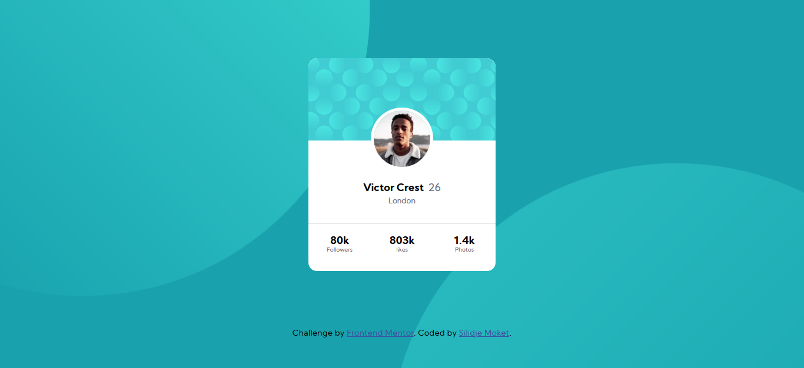
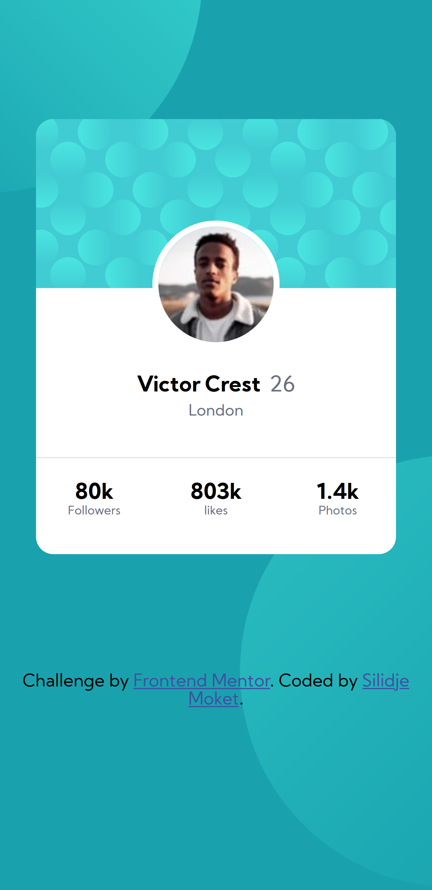

# Frontend Mentor - Profile card component solution

This is a solution to the [Profile card component challenge on Frontend Mentor](https://www.frontendmentor.io/challenges/profile-card-component-cfArpWshJ). Frontend Mentor challenges help you improve your coding skills by building realistic projects.

## Table of contents

- [Frontend Mentor - Profile card component solution](#frontend-mentor---profile-card-component-solution)
  - [Table of contents](#table-of-contents)
  - [Overview](#overview)
    - [The challenge](#the-challenge)
    - [Screenshot](#screenshot)
    - [Links](#links)
  - [My process](#my-process)
    - [Built with](#built-with)
    - [What I learned](#what-i-learned)
    - [Useful resources](#useful-resources)
  - [Author](#author)

## Overview

The challenge was to build out a profile card component and get it looking as close to the design provided as possible.

### The challenge

- Build out the project to the designs provided.

### Screenshot




### Links

- Solution URL: [Repository URL here](https://github.com/Isenraf/Isenraf.profile-card-component.github.io)
- Live Site URL: [Live site URL here](https://isenraf.github.io/Isenraf.profile-card-component.github.io/)

## My process

- Started by structuring the content with the appropriate semantic tag.
- Then styled the content.

### Built with

- Semantic HTML5 markup
- CSS3 custom properties
- CSS Grid
- Media Queries

### What I learned

This challenge helped me better understand the use of the background position property and really the power of the grid layout. Also I found that structuring our html using the appropriate semantic as well as choosing good names for our class is of good use before styling.

```css
body {
  background-image: url('images/bg-pattern-top.svg'),
    url('images/bg-pattern-bottom.svg');
  background-repeat: no-repeat;
  background-position: top 120% left -90%, 170% -70%;
}

main {
  display: grid;
  grid-template-columns: 1fr;
  margin: 5.5em;
}

article {
  display: grid;
  grid-template-columns: repeat(3, 1fr);
  grid-auto-rows: auto;
  justify-self: center;
  align-self: center;
  border-radius: 0.8em;
  background-color: white;
}

img {
  grid-column: 2;
  grid-row: 1;
  justify-self: center;
  align-self: flex-end;
  border: 5px solid white;
  border-radius: 100%;
  position: relative;
  top: 50px;
}
```

### Useful resources

- [Css Tricks](https://css-tricks.com/snippets/css/complete-guide-grid/) - This helped me to better place my contents on the grid.
- [Mozilla Developer Center](https://developer.mozilla.org/en-US/docs/Learn/CSS/CSS_layout/Grids) - This is a good article for who wants to understand the fundamentals of grid layout. I'd recommend it to anyone still learning this concept.

## Author

- Frontend Mentor - [@Isenraf](https://www.frontendmentor.io/profile/Isenraf)
